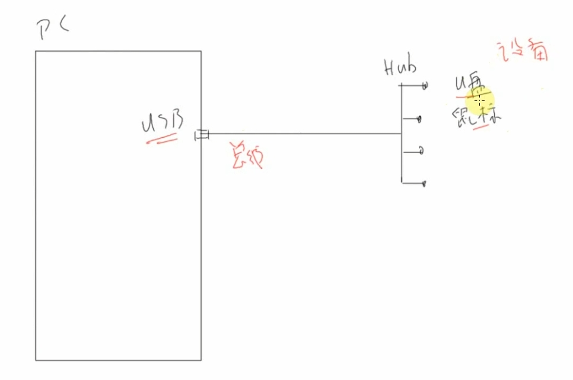
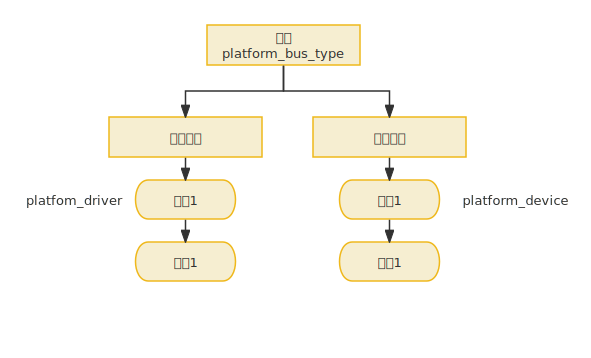
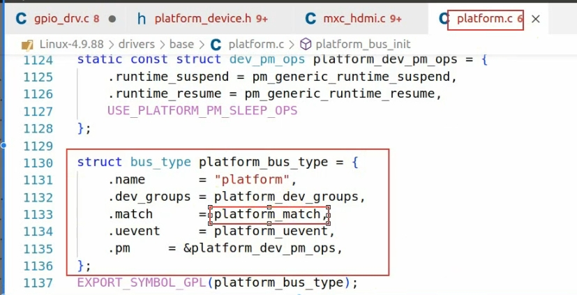
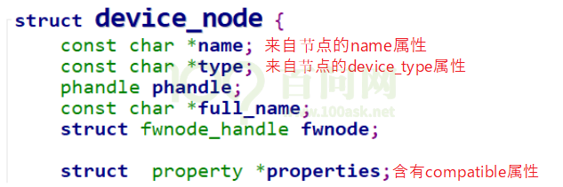
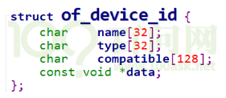
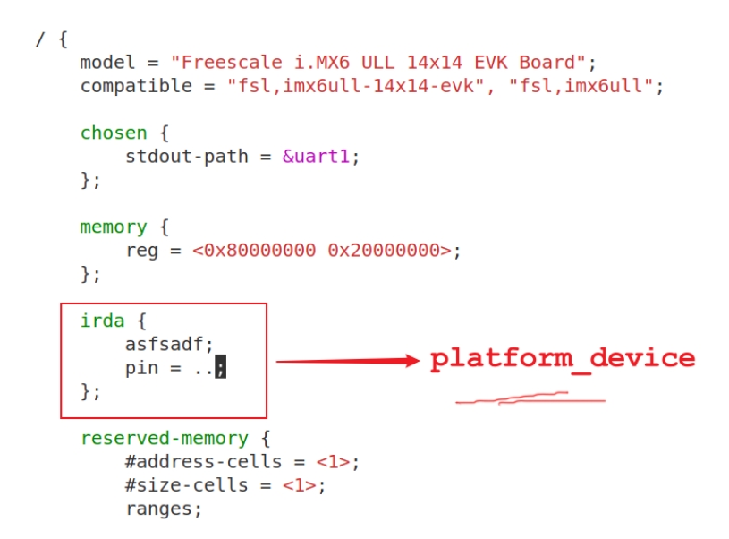

### 1.平台设备总线驱动模型

> 理论学习可以参考《第五篇 嵌入式Linux驱动开发基础知识》或者《应用开发完全手册》
>
> 

#### 总线

虚拟总线platform_bus_type

什么是总线？物理总线：如一个usb连接hub



总线平台结构体如下图：`platform_bus_type : platform_device_add(struct platform_device *pdev) , platform_driver_register(drv)`



`platform_driver_registe`: 通用的代码

```c
struct platform_driver {
	int (*probe)(struct platform_device *);
	int (*remove)(struct platform_device *);
	void (*shutdown)(struct platform_device *);
	int (*suspend)(struct platform_device *, pm_message_t state);
	int (*resume)(struct platform_device *);
	struct device_driver driver;
	const struct platform_device_id *id_table;
	bool prevent_deferred_probe;
};
//示例
static struct platform_driver sa1111_device_driver = {
	.probe		= sa1111_probe,
	.remove		= sa1111_remove,
	.driver		= {
		.name	= "sa1111",
		.pm	= &sa1111_pm_ops,
	},
};
```


`struct platform_device`：含有硬件资源（寄存器地址、内存地址、中断号）

```c
struct platform_device {
	const char	*name;
	int		id;
	bool		id_auto;
	struct device	dev;
	u32		num_resources;
	struct resource	*resource;

	const struct platform_device_id	*id_entry;
	char *driver_override; /* Driver name to force a match */

	/* MFD cell pointer */
	struct mfd_cell *mfd_cell;

	/* arch specific additions */
	struct pdev_archdata	archdata;
};
```


#### 添加方式与基本流程

`platform_device_add(struct platform_device *pdev)`  添加一个平台device：

- 把struct platform_device *pdev放入链表
- 去遍历驱动链表，看双方是否匹配（为设备寻找驱动程序）
- 如果匹配就调用platform_driver的probe函数
  - 从platform_device 得到引脚编号
  - 注册file_operations结构体（如字符设备驱动程序）

注：使用上述方式，将驱动程序拆分为驱动和设备资源两个部分，解决如**硬件引脚变化需要去阅读修改源码的问题**。


`platform_driver_register(drv)` 注册一个平台drv：

同样的，一个新的drv注册后，会去匹配对应的dev


#### 如何比较drv和dev进行匹配



> 参考《嵌入式Linux应用开发完全手册V5.1_IMX6ULL_Pro开发板》的 11.5 platform_device如何与platform_driver配对
>
> ```c
> static int platform_match(struct device *dev, struct device_driver *drv)
> {
> 	struct platform_device *pdev = to_platform_device(dev);
> 	struct platform_driver *pdrv = to_platform_driver(drv);
> 
> 	/* When driver_override is set, only bind to the matching driver */
> 	if (pdev->driver_override)
> 		return !strcmp(pdev->driver_override, drv->name);
> 
> 	/* Attempt an OF style match first */
> 	if (of_driver_match_device(dev, drv))
> 		return 1;
> 
> 	/* Then try ACPI style match */
> 	if (acpi_driver_match_device(dev, drv))
> 		return 1;
> 
> 	/* Then try to match against the id table */
> 	if (pdrv->id_table)
> 		return platform_match_id(pdrv->id_table, pdev) != NULL;
> 
> 	/* fall-back to driver name match */
> 	return (strcmp(pdev->name, drv->name) == 0);
> }
> ```
>
> 判断顺序：
>
> 1. 是否强制选择某个driver
>
>    - 比较`platform_device.driver_override`和`platform_driver.driver.name`
>
>    - 可以设置`platform_device`的`driver_override`，强制选择某个`platform_driver`
>
> 2. 设备树信息
>
>    - 比较`platform_device.dev.of_node`和`platform_driver.driver.of_match_table`
>      由设备树节点转换得来的 platform_device 中，含有一个结构体：of_node。
>      
>      如果一个platform_driver支持设备树，它的platform_driver.driver.of_match_table是一个数组，类型如下：
>      
>    - 首先，如果 of_match_table 中含有 compatible 值，就跟 dev 的 compatile属性比较，若一致则成功，否则返回失败；
>    - 然后，如果 of_match_table 中含有 type 值，就跟 dev 的 device_type 属性比较，若一致则成功，否则返回失败；
>    - 最后，如果 of_match_table 中含有 name 值，就跟 dev 的 name 属性比较，若一致则成功，否则返回失败。
>    - 而设备树中建议不再使用 devcie_type 和 name 属性，所以**基本上只使用设备节点的 `compatible` 属性来寻找匹配的 `platform_driver`**。
>
> 3. **platform_device_id**
>
>    - 比较 `platform_device.name` 和 `platform_driver.id_table[i].name`，`id_table` 中可能有多项。
>
>    - platform_driver.id_table 是“platform_device_id”指针，表示该 drv支持若干个 device，它里面列出了各个 device 的{.name, .driver_data}，
>
>      其中的“name”表示该 drv 支持的设备的名字，driver_data 是些提供给该 device 的私有数据。
>
> 4. `platform_device.name` 和 `platform_driver.driver.name`


### 2.设备树

不使用.c文件注册platform_device，因为每次修改都需要重新编译装载。

使用设备树。目的都是去构造一个platform_device结构体。

查看设备树：

```shell
# ubuntu
cd /home/book/100ask_imx6ull-sdk/Linux-4.9.88/
cd arch/arm/boot/dts/
vi 100ask_imx6ull-14x14.dts
```



uboot: SD卡里有设备树dtb读取到内存，有内核uImage读取到内存，启动内核(addr)会解析设备树文件，注册各种patform_device。

因此同一款芯片的不同产品，内核可以保持不变，设备树可以变化。


---

请点击**左侧菜单**（移动端为**右下角**）选择要查看的所有笔记吧。