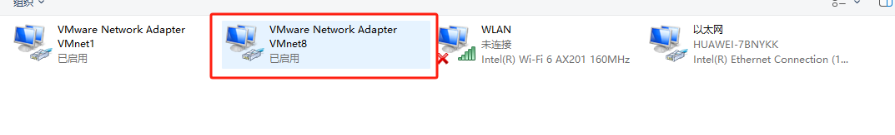
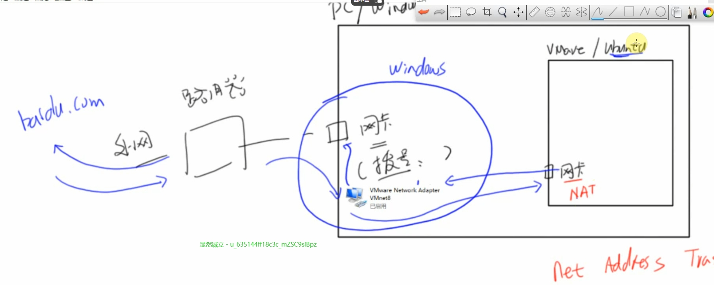
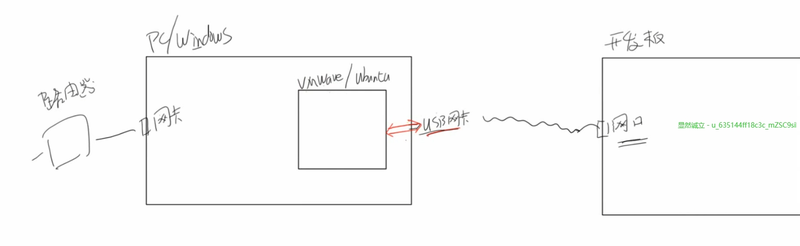
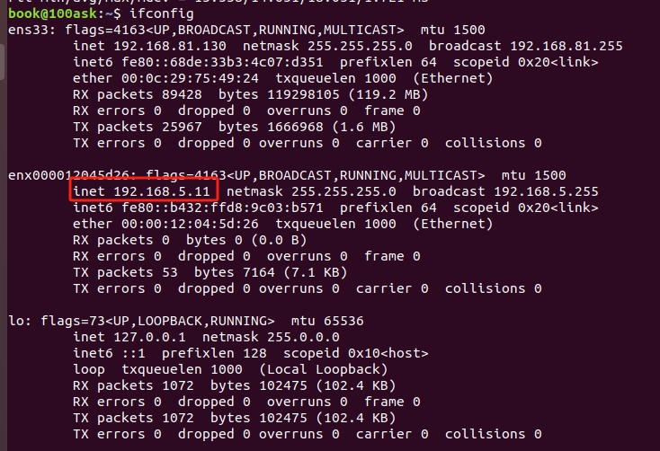
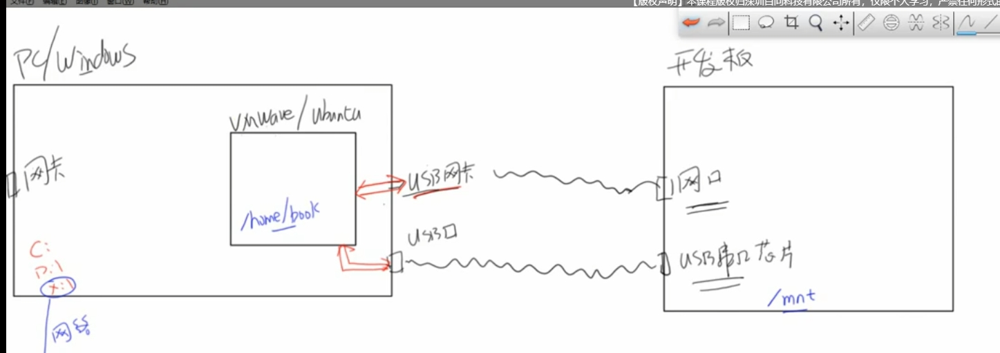
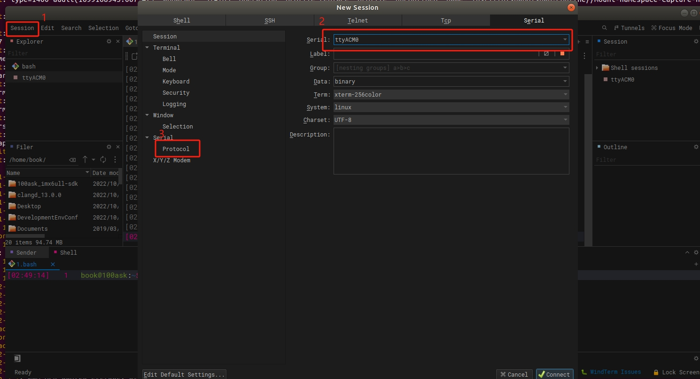
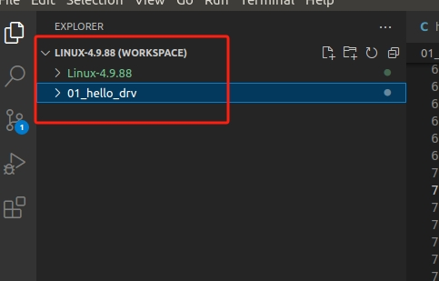

### NAT网卡：Net Address Translate

装好ubuntu虚拟机，windows会有虚拟网卡




### USB网卡

把usb网卡直接连接到虚拟机。
- 把USB网卡连接到Ubuntu
- 在Ubuntu里面设置ip

- ifconfig查看一下




### 使用串口

- 将串口连接到虚拟机



- 使用windTerm软件创建一个Session




显示权限报错，因为book用户没有权限，修改软件的权限，默认已经被修改了，还是有问题执行以下操作：
```bash
sudo newgrp dialout tty
sudo usermod -a -G dialout book
sudo usermod -a -G tty book
```

创建一个文件 /usr/share/applications/windterm.desktop ，内容如下：

  ```bash
  [Desktop Entry]
  Name=WindTerm
  Comment=A professional cross-platform SSH/Sftp/Shell/Telnet/Serial terminal
  GenericName=Connect Client
  Exec=/home/book/WindTerm_2.5.0/WindTerm
  Type=Application
  Icon=/home/book/WindTerm_2.5.0/windterm.png
  StartupNotify=false
  StartupWMClass=Code
  Categories=Application;Development
  Actions=new-empty-window
  Keywords=windterm
  [Desktop Action new-empty-window]
  Name=New Empty Window
  Icon=/home/book/WindTerm_2.5.0/windterm.png
  Exec=/home/book/WindTerm_2.5.0/WindTerm
  ```


然后增加可执行权限、并启动程序：

  ```bash
  sudo chmod +x /usr/share/applications/windterm.desktop
  /home/book/WindTerm_2.5.0/WindTerm
  ```

这些问题一般已经设置好了。

我遇到在桌面点击图标打开的时候不能正常打开串口的问题，在命令行中进入目录然后执行才可以：

```bash
cd /home/book/WindTerm_2.5.0/
./WindTerm
```

先尝试在开发板上ping通，然后挂载网络文件系统：开发板把/home/book 目录挂载到/mnt目录

```bash
ping 192.168.5.11
mount -t nfs -o nolock,ver=3 192.168.6.11:/home/book /mnt
```

### vscode

建立一个工作区：工作区中可以包含多个文件夹。



快速跳转预览的vscode插件：clangd插件
它解析目录，创建了很多索引，用于帮助快速跳转。

见《在Ubuntu中搭建嵌入式Linux开发环境》PDF

---

请点击**左侧菜单**（移动端为**右下角**）选择要查看的所有笔记吧。